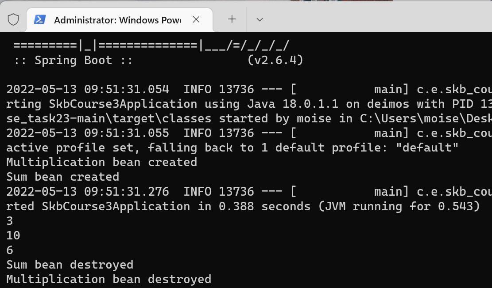

# skbCourse_task23

## Calculator class
Используется DI через поле

## Adder class
Используется DI через конструктор

## ArrayListMathWorker class
Используется DI через сеттеры

## Multiplication и Sum
Два бина разных классов, реализующих один интерфейс MathAction.

## Демонстрация работы

## Запуск
1. Выполните следующие команды:
`mvn package`
`mvn spring-boot:run`

